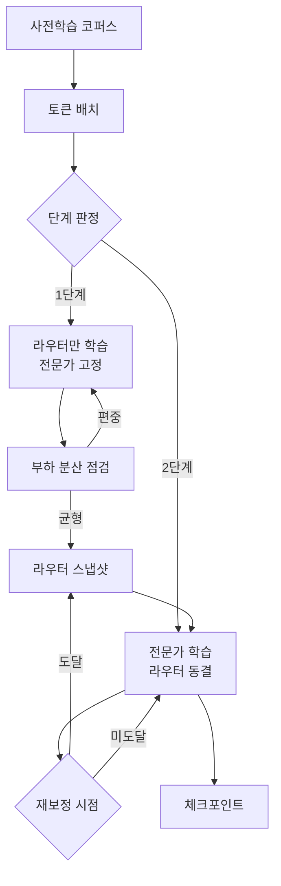

희소 MoE 학습에서 가장 자주 깨지는 곳은 라우터다. 초기 몇천 스텝 동안 일부 전문가에 토큰이 쏠리면, 쏠린 전문가만 빨리 학습되고 나머지는 영영 기회를 못 받는다. 보조 손실로 균형을 강제하는 방법이 표준이지만 계수를 잡기 까다롭고 본 손실과 싸운다. 이 논문은 라우터를 본 학습과 **시간적으로 분리**한다.

## 파이프라인

1단계에서는 전문가를 고정한 채 라우터만 학습시켜 분포를 펴 놓고, 2단계에서 라우터를 얼려 본 학습에 들어간다. 이후 정해진 간격으로 라우터만 짧게 다시 녹인다.

판정 조건은 단순하다. 전문가별 토큰 점유율의 변동 계수가 임계값 아래로 내려오면 1단계를 끝낸다. 저자들이 쓴 임계값은 0.15 였고, 8B 규모에서 대략 3천 스텝 안에 도달했다.

## 결과

같은 FLOPs 예산에서 최종 검증 손실이 기존 보조 손실 방식 대비 0.04 낮았다. 크지 않아 보이지만 다운스트림 정확도로는 2~3포인트 차이였다. 더 눈에 띄는 것은 **전문가 사용률의 분산**으로, 학습 종료 시점에 죽은 전문가(점유율 1% 미만)가 하나도 없었다고 한다.

<Callout type="warning" title="재현 시 주의">
  라우터 재보정 간격이 너무 촘촘하면 2단계 학습이 계속 흔들린다. 논문 부록의 기본값은 2만 스텝이고, 이보다 짧게 잡은 설정에서는 이득이 사라졌다.
</Callout>

## 남는 질문

전문가를 고정한 채 라우터만 학습한다는 것은, 아직 아무것도 배우지 않은 전문가들 사이에서 라우팅을 배운다는 뜻이다. 이 시점의 분포가 나중까지 의미가 있으려면 전문가 초기화가 서로 충분히 달라야 하는데, 논문은 이 부분을 초기화 시드 차이로만 다룬다. 전문가별로 다른 데이터 슬라이스를 잠깐 보여 주고 시작하면 어떻게 될지가 궁금하다.
